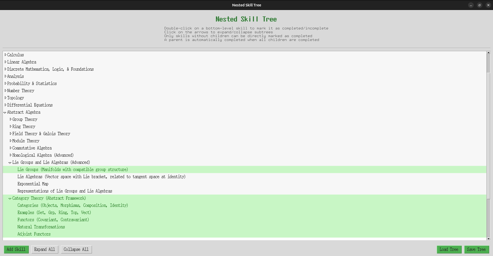

# Nested Skill Tree

A simple application that displays a hierarchical skill tree with the ability to mark skills as completed and expand/collapse subtrees. Built with Python's standard tkinter library.



## Features

- Hierarchical display of skills
- Mark skills as completed or incomplete with a double-click
- Expand and collapse subtrees
- Parent skills are automatically marked as completed when all child skills are completed
- Child skills inherit completion status from parent when parent is marked
- Add new skills to any part of the tree
- Expand all or collapse all nodes with a single click
- Save your skill tree to a JSON file
- Load skill trees from JSON files

## Installation

1. Ensure you have Python 3.6+ installed
2. No external dependencies required - uses standard Python libraries

## Usage

Run the application:

```bash
python3 skill_tree.py
```

### How to Use

- **Double-click** on any skill to mark it as completed or incomplete
- **Click** on the arrow next to a skill to expand or collapse its subtree
- **Add Skill** button allows you to add new skills to the tree
- **Expand All** / **Collapse All** buttons to expand or collapse the entire tree
- **Save Tree** / **Load Tree** buttons to save your progress or load existing skill trees

## Sample Skill Tree

The application includes a sample skill tree file (`sample_tree.json`) with a more comprehensive structure that includes:
- Mathematics (Arithmetic, Algebra, Geometry)
- Programming (Web Development, Python)

To load this sample:
1. Start the application
2. Click the "Load Tree" button
3. Navigate to and select the `sample_tree.json` file

## Default Skill Tree

The application now loads a comprehensive mathematics skill tree from `math.txt` by default, which includes:

- Arithmetic & Pre-Algebra
- Algebra (Elementary, Intermediate, Precalculus)
- Geometry
- And many sub-skills within each category

If `math.txt` is not found, the application will fall back to a simple default skill tree structure:

```
Arithmetic & Pre-Algebra
- Basic Arithmetic
  - Counting
Algebra
- Elementary Algebra
  - Linear Equations
```

## Customizing the Skill Tree

You can create your own skill tree in two ways:

1. **Edit the math.txt file** - The application reads this file by default. The file uses indentation to indicate hierarchy (2 spaces per level).

2. **Use the Application UI** - You can add skills using the "Add Skill" button and organize them as needed.

3. **Code Modification** - Edit the `_populate_default_tree` method in the `SkillTreeApp` class in `skill_tree.py`.

## Saving and Loading

You can save your skill tree progress using the "Save Tree" button. This creates a JSON file that includes your completion status.

To load a previously saved skill tree, click the "Load Tree" button and select your JSON file.

## Customization

To add or modify skills, edit the `populate_tree` method in the `SkillTreeApp` class in `skill_tree.py`. 